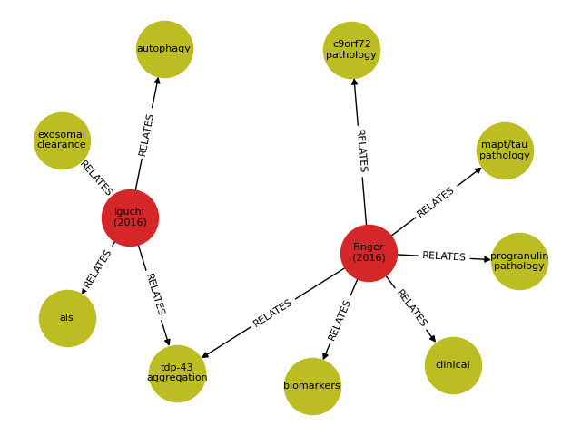

[](https://joss.theoj.org/papers/1c9701c5d909d9b8255b754677b2ea51)

# scribl
## A system for the semantic capture of relationships in biological literature

The **scribl** language was designed for the curation from scientific
articles, of the relationships between the various biological agents
and processes that they describe, with a view to generating a graph
database that captures these relationships as a connected network.

**scribl** statements are added as tags to articles in a literature
database (the **scribl** codebase currently supports the free,
open-source [Zotero](https://www.zotero.org/) database). These tags are
parsed and used to create a graph data structure that can be then be
exported for use in a graph database platform such as
[neo4j](https://neo4j.com), or Python's
[NetworkX](https://networkx.org/).

For example:

```
::agent c9orf72 :gene :protein :url https://www.uniprot.org/uniprot/Q96LT7
::agent gtp :tag nucleoside, purine, nucleoside triphosphate
::process exportin releases cargo into cytoplasm @ exportin-1
::process smcr8 mutation > ulk1 phosphorylation < autophagy = smcr8 expression
```

Full details of the language are available in the full documentation contained in
[scribl.pdf](https://github.com/amberbiology/scribl/blob/main/scribl.pdf).

## Quickstart install and test

We recommend installing in a virtual environment.

### Install from PyPI (not yet available)

<strike>

``` shell
pip install scribl
```

</strike>

### Install via GitHub repo

``` shell
git clone https://github.com/amberbiology/scribl.git
cd scribl
pip install .
```

This will pull in all relevant Python dependencies, including
[pyparsing](https://github.com/pyparsing/pyparsing),
[pyzotero](https://github.com/urschrei/pyzotero) and others within
your virtual environment

### Test your installation

When scribl is installed, it contains a command-line program `scribl`
that can perform some common API tasks, and to help the user jumpstart
exploring using the system.  After installation here are two example
command-line you can cut-and-paste and run from the terminal to check
installation:

#### Check version

``` shell
scribl --version
```

#### Check outputs

First create a new, empty directory and change into it, e.g.:

``` shell
mkdir /tmp/scribl-test
cd /tmp/scribl-test
```

Then run:

``` shell
scribl -g new_graphdb --zotero-library 5251557:group --networkx-fig graphdb-visual.png --graphmlfile graphdb.xml --cyphertextfile graphdb.cypher
```

This will read from a public Zotero `group` collection we have created
(ID `5251557`) for testing purposes, that includes citations with
scribl tags.  This example run generates the following outputs:

* `new_graphdb` - directory containing the new scribl database

* `graphdb.cypher` - a plain text file in the [Cypher query
  language](https://opencypher.org/)

* `graphdb.xml` - an XML file in
  [GraphML](http://graphml.graphdrawing.org/) format

* `graphdb-visual.png` - a visualization of the GraphML graph in PNG
  format:

  

  see below for a more detailed description of visualization options.

## Visualization of the scribl database

As mentioned previously, a `scribl` database can be exported for use
in a graph database platform for further interactive exploration. One
of the most developed graph visualization platforms is as
[Neo4j](https://neo4j.com) which reads the output in [Cypher query
language](https://opencypher.org/) . Unfortunately Neo4j isn't
directly available via Python packaging system. The instructions for
installation and configuration is beyond the scope of this
documentation, but they are [available for most
platforms](https://neo4j.com/docs/operations-manual/current/installation/).
The [main scribl documentation](scribl.pdf) describes how to take the
exported Cypher text generated by a command like the above into Neo4j
and dynamically update the Neo4j database.

In the interests getting up and running quickly with visualizations,
but staying purely within the Python ecosystem, `scribl` also supports
outputs other than Cypher. The above mentioned
[GraphML](http://graphml.graphdrawing.org/) backend generates
visualizations using a combination of
[NetworkX](https://networkx.org/) and matplotlib. This feature enables
generation of static visualizations of the current scribl database.
Visualizations generated via the GraphML/NetworkX are best suited for
small networks and to get a feel for the scribl database structure
with a minimum of fuss. For "production" level visualization as well
as interactive analyses, however, you are likely to want to try Neo4j.

## Examples of `scribl` command-line program

Here are some common scribl tasks you can do using the `scribl`
command-line:

### Create a new database from Zotero library

``` shell
scribl -g new_graphdb --zotero-library <LIBRARY_ID>:<TYPE> --zotero-api-key <API_KEY>
```

A scribl database is created in current directory with the name
`new_graphdb` using the Zotero `LIBRARY_ID` with specified `TYPE`
(either `user` or `group`). An `API_KEY` is only needed in the case of
accessing private libraries, or non-public group libraries. The
`pyzotero` library has
[documentation](https://github.com/urschrei/pyzotero#quickstart) on
how to find out your library ID and creating an API key.


### Create a new database from a local Zotero CSV file

``` shell
scribl -g new_graphdb --zoterofile <ZOTERO_CSV>
```

This populates the database from a local CSV file `ZOTERO_CSV` exported
from a Zotero library.  Note that the above two commands, just create (or
read from an existing) database, but generate no output. (Note that the
`new_graphdb` database is not overwritten if it already exists, unless the
`--overwrite` flag is also supplied)

To generate outputs, there are a number of options. All assume at
least one Zotero database has been imported, either from a local CSV
file, or via the Zotero library API (i.e. at least one of the import
steps above have been run at least once). Outputs will be skipped if
the database empty.

### Output representation of graph in GraphML format

``` shell
scribl -g new_graphdb --graphmlfile <OUTPUT_XML>
```

This generates output in GraphML XML format (e.g. `OUTPUT_XML` should
be supplied with the appropriate extension, e.g. `graphdb.xml`).

### Output a NetworkX visualization

``` shell
scribl -g new_graphdb --networkx-fig <OUTPUT_IMAGE>
```

This generates and saves the visualization as as one of the
`matplotlib` supported `OUTPUT_IMAGE` formts, using data from current
scribl database (for example, using `graphdb-visual.pdf` would
generate it in PDF format). The visualizations are produced from
GraphML XML output that is rendered using Python's NetworkX
library.

### Output representation of graph as a Cypher file

``` shell
scribl -g new_graphdb --cyphertextfile <OUTPUT_CYPHER>
```

The above outputs a Cypher text representation of the database in the
file `OUTPUT_CYPHER`, as a plain text file in the previously mentioned
[Cypher query language](https://opencypher.org/), suitable for import
into [Neo4J](https://neo4j.com/).

For a full description of all command-line arguments, run:

``` shell
scribl --help
```

## Using the `scribl` API directly in your programs

You can write your own Python program using the API directly. For
example, the code below, generates the same outputs as the [check
outputs](#check-outputs) example above. It creates a new database,
populates it from the same remote Zotero library, and then generates
`graphdb.xml` (GraphML), `graphdb.cypher` (Cypher) and
`graphdb-visual.png` (PNG).


``` Python
from scribl.manage_graphdb import GraphDBInstance

gdb = GraphDBInstance("newgraph_db")
gdb.set_metadata("Test Scribl DB", "User name", "Small test")
gdb.import_zotero_library(5251557, "group")
gdb.load_zotero_csv()
gdb.export_graphml_text(filepath="graphdb.xml")
gdb.export_graphml_figure(filepath="graphdb-visual.png")
gdb.export_cypher_text(filepath="graphdb.cypher")
```

The [code](/scribl/scribl.py) for the `scribl` command contains more
examples of use of the API. In addition, more details can be found
in the main documentation.

## Running unit tests with `pytest`

1. clone the repo:

   ``` shell
   git clone https://github.com/amberbiology/scribl.git
   ```

2. install with `pip` with the option `test` package :

   ``` shell
   pip install .[test]
   ```

3. run `pytest`

   Note that `pytest` creates output sandbox test files
   [in the system temporary directory](https://docs.pytest.org/en/6.2.x/tmpdir.html#the-default-base-temporary-directory),
   e.g. on Linux `pytest` creates a directory structure
   `/tmp/pytest-of-USER/pytest-NUM/scribl_sandboxNUM` where `USER` is
   the current user and `NUM` is incremented on each run. Only the
   last three directories are retained.

## Development and contributing to `scribl`

`scribl` is completely open-source and being developed by Amber Biology LLC (@amberbiology).

If you're interested in contributing, please read our [CONTRIBUTING guide](CONTRIBUTING.md).

## Copyright and license

scribl is Copyright (C) 2023, 2024. Amber Biology LLC

scribl is distributed under the terms of [AGPL-3.0 license](LICENSE)


## Acknowledgements

The development of the scribl platform was made possible by the
funding and expertise provided by the Association for Frontotemporal
Degeneration (AFTD - https://www.theaftd.org/) whose mission is to
improve the quality of life of people affected by Frontotemporal
Degeneration and drive research to a cure.  We are particularly
grateful to AFTD leadership team members Debra Niehoff and Penny Dacks
for their invaluable direction and guidance, and for getting us access
to leading researchers in the field of neurodegenerative disease - all
of whose insights and advice were pivotal in the development of this
free, open-source research tool.
