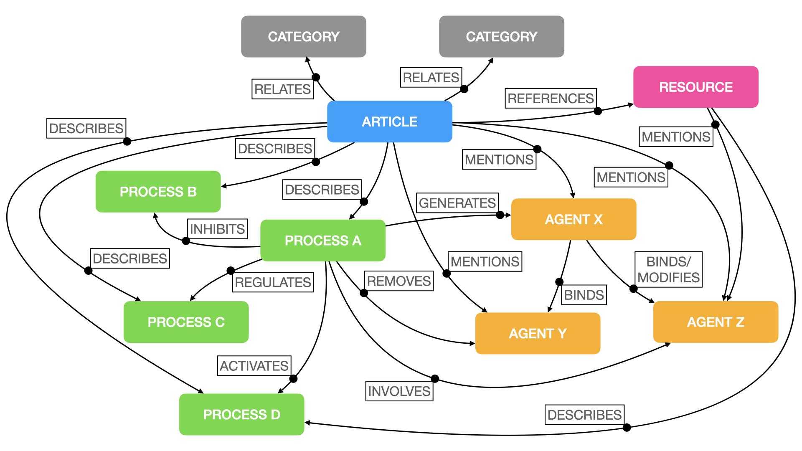

# Summary

Searchable catalogs of curated scientific literature and metadata
often lack semantic detail contained in the curated articles. Typical
literature searches based upon text and keywords are a blunt
instrument, generating large sets of articles of potential interest
that need to be read more closely to determine if they are relevant to
the researcher. In life science research, most scientific literature
databases are most immediately useful to scientists looking for
information in two categories (1) those looking general literature on
a broad research area, or (2) those looking for a precise terms,
e.g. a specific gene or author. A third category of literature search
exists in between these two extremes: searches where the desired
results involve a small set of agents (e.g., proteins, genes,
compounds, receptor complexes) or biological processes (e.g,
autophagy, cell cycle), but that are themselves components of much
larger systems, as needed in systems biology models.

It is extremely valuable for life researchers, especially those
involved in systems biology, to be able to query a literature database
to extract and visualize relationships between any specified agents
and processes. Here we develop a system that supports the annotation
of scientific articles, to represent and visualize these
relationships. This system, `scribl`, consists of two parts: (1) a
simple syntax that can be used to curation of biological relationships
within the text of those articles, (2) a Python software pipeline that
can transform a literature database (currently supporting the free,
open-source [Zotero](https://www.zotero.org/) database) with entries
annotated with this syntax into graph database suitable for
relationship queries.

# Features

## The `scribl` language

The language was designed for the curation of scientific articles to
include documentation of the relationships between the various
biological agents and processes that they describe. Valid
relationships for each entity are shown in
\autoref{fig:scribl-schema}.

`scribl` statements are added as tags by a curator to each article in
a literature database to represent aspects of causal relationships
identified by the curator.

|   |
|:--|
| `::agent c9orf72 :gene :protein :url https://www.uniprot.org/uniprot/Q96LT7`     |
| `::agent gtp :tag nucleoside, purine, nucleoside triphosphate`                   |
| `::process exportin releases cargo into cytoplasm @ exportin-1`                  |
| `::process smcr8 mutation > ulk1 phosphorylation < autophagy = smcr8 expression` |
: Example scribl statements included in Zotero tags\label{scribl-examples}

\autoref{scribl-examples} shows two types of entities: (1) agents
(`::agent`): are actual biochemical entities (e.g. proteins) described
in the literature article in question, allow with some metadata about
the agent in question, (2) processes (`::process`) which represent
biological processes, which may be a specific biochemical process, but
more likely are more of a coarser-grained nature.

## The `scribl` Python package.

The `scribl` Python package can query a [Zotero](https://zotero.org)
database where each literature record has been annotated using
Zotero's "tag" feature with declarative statements in `scribl` syntax
described above.

`scribl` input: currently the literature source can be either a remote
Zotero database, or via a file export from a local Zotero
installation. Once the literature database has been queried and
parsed, the resulting graph data structure can be then be exported for
use in a graph database platforms
(\autoref{fig:scribl-workflow}). `scribl` also supports the
incremental updating of the graph database based on new Zotero
entries.

`scribl` currently supports output in one of two formats:

1. [Cypher query
language](https://opencypher.org/)[@francis_cypher_2018] used by the
graph database platform [neo4j](https://neo4j.com). The output Cypher
query can be used directly to initialize a Neo4j database.  The Neo4j
setup itself it not done by `scribl`, but must be installed
separately.

2.  [GraphML](http://graphml.graphdrawing.org/)
[@brandes_graphml_2002] format. This format can be read and used for
processing and visualization by packages such as Python's
[NetworkX](https://networkx.org/) [@hagberg_exploring_2008]. (see
\autoref{fig:graph-networkx} for example).

Once created, it is possible to create searches on the graph database
not possible with traditional keyword searching. For example, once the
scribl output is loaded into a Neo4j database, it is possible to write
Cypher queries of the kind: "Show me all of the agents that are
involved in the process `exportin` and the articles that describe
them".

# Statement of need

## Why `scribl`?

The `scribl` platform was developed to fill a need for a simple way to
enable global sharing and collaborative curation of biological
relationships embedded in literature records, and to rapidly translate
those relationships into queryable graph networks. The `scribl` syntax
was designed to be simple enough to learn, but rich enough to
represent important relationships relevant to molecular and systems
biology. The relationships captured in `scribl` are not intended to
replace a reading of the literature but rather to further narrow down
the search for relevant biological agents and processes.

Zotero was also chosen as the initial backend, because it is simple to
add tags to each literature record, and supports the web-based
curation features, and doesn't require a heavy-duty database to
maintain. `scribl` allows a researcher, or group of researchers, to
rapidly build and visualize important relationships useful for
understanding the celluar and systems biology within a chosen
subdomain.  It is also often desirable for researchers to curate
literature databases that are focused on narrower, more specific areas
of interest, including those that may also be underrepresented in
larger data repositories. In fact our main use-case for `scribl` was
building a relationship database of neurodegenerative disease pathways
for the FTD community.

At the time of writing, even though a biological system can be
described in great detail in a scientific article, natural language
processing technology, such as large-language models, required to
extract an accurate, formal model of that system from the article text
has yet to reach the level at which this could realistically be
achieved algorithmically. Thus some level of manual, but structured,
curation is likely to be useful for in the immediate future.

## What `scribl` is not

Although `scribl` is not primarily intended for the construction of
formal kinetic systems biology models such as the modeling languages
[Kappa](https://kappalanguage.org/) [@boutillier_kappa_2020] and
[SBML](https://sbml.org/) [@keating_sbml_2020]. However, these
networks could be considered a coarse-grained model of biological
systems that sits somewhere between the very low resolution
representation of a system by keywords and literature terms, and the
very high resolution representation of a formal, kinetic
model. `scribl`-enabled networks may, however, help researchers
identify the interactions or parameters that require measurement in
order to build those detailed models.

`scribl` is also not intended to be a replacement for biological graph
databases such as [Reactome](https://reactome.org)
[@gillespie_reactome_2022]. The Reactome database is actually based
upon the same graph database engine that is the current default
supported by scribl, so `scribl` could actually help facilitate the
curation of biological pathways from newly-published literature, in a
format that is ready for graph data repositories like Reactome.

# Availability

`scribl` is available as a package on PyPI with the source code and
documentation available at https://github.com/amberbiology/scribl.

# Acknowledgements

The development of the scribl platform was made possible with the
support of the [Association for Frontotemporal Degeneration
(AFTD)](https://theaftd.org/). We are grateful to AFTD members Debra
Niehoff and Penny Dacks for their support.

# References
